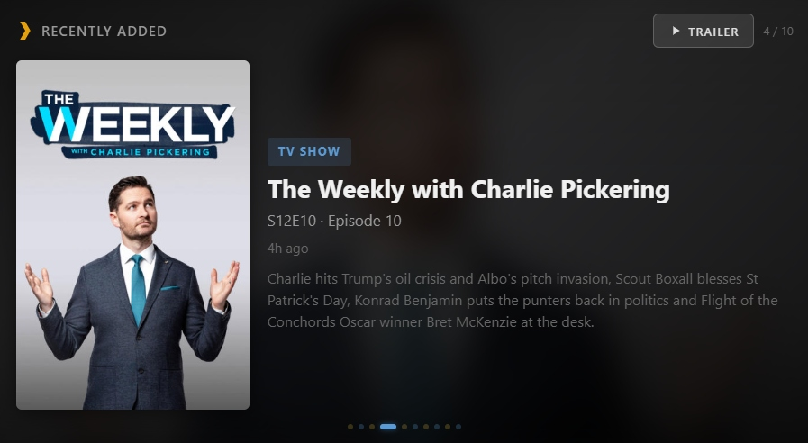

# Kodi Recently Added Card

A custom Home Assistant Lovelace card that shows your recently added movies and TV shows from Kodi. Auto-cycles through items with poster art, blurred background, synopsis, ratings, and color-coded indicators.

[](https://github.com/hacs/integration)


<p align="center">
  
</p>

## Features

- Displays the 5 most recently added movies and 5 most recently added TV shows from Kodi
- Interleaved cycling — alternates between movies and TV shows
- Poster art with blurred background transitions
- Synopsis, ratings, genre, and "time ago" for each item
- Color-coded dots — gold for movies, blue for TV shows
- Connects directly to your Kodi web interface (no additional integrations required beyond the Kodi add-on)
- Deduplicates TV shows — only shows the most recent entry per series
- **Trailers** — tap the trailer button on any movie to open its YouTube trailer (requires a free TMDB API key)

---

## Install via HACS (Recommended)

1. Open **HACS** in Home Assistant
2. Click the three dots (top right) → **Custom repositories**
3. Enter `https://github.com/rusty4444/kodi-recently-added-card` and select **Dashboard** as the category
4. Click **Add**
5. Search for "Kodi Recently Added Card" in HACS and click **Install**
6. Restart Home Assistant

The Lovelace resource will be registered automatically.

## Install Manually

1. Download `kodi-recently-added-card.js` from the [latest release](https://github.com/rusty4444/kodi-recently-added-card/releases/latest)
2. Place it in your `<config>/www/` directory
3. Go to **Settings → Dashboards** → three dots (top right) → **Resources**
4. Click **Add Resource**
5. URL: `/local/kodi-recently-added-card.js`
6. Type: **JavaScript Module**

---

## Configuration

Add a **Manual card** to your dashboard with this YAML:

```yaml
type: custom:kodi-recently-added-card
kodi_url: http://YOUR_KODI_IP:8080
kodi_username: kodi
kodi_password: kodi
movies_count: 5
shows_count: 5
cycle_interval: 8
title: Recently Added
tmdb_api_key: YOUR_TMDB_READ_ACCESS_TOKEN  # Optional: enables trailer button for movies
```

For best results, set the card to span the full width of a section and give it plenty of vertical space (e.g., 8+ grid rows).

### Options

| Option | Type | Default | Description |
|--------|------|---------|-------------|
| `kodi_url` | string | **Required** | Your Kodi web interface URL (e.g., `http://192.168.1.100:8080`) |
| `kodi_username` | string | optional | Kodi web interface username (if set) |
| `kodi_password` | string | optional | Kodi web interface password (if set) |
| `movies_count` | number | `5` | Number of recently added movies to display |
| `shows_count` | number | `5` | Number of recently added TV shows to display |
| `cycle_interval` | number | `8` | Seconds between cycling to the next item |
| `title` | string | `"Recently Added"` | Header text (set to empty string to hide) |
| `tmdb_api_key` | string | Empty (trailers disabled) | TMDB Read Access Token — enables the trailer button on movies |

---

## How to Enable Kodi's Web Interface

The card connects directly to Kodi's built-in JSON-RPC API over HTTP. To enable it:

1. In Kodi, go to **Settings → Services → Control**
2. Enable **Allow remote control via HTTP**
3. Note the **Port** (default is `8080`)
4. Optionally set a **Username** and **Password** for security
5. Use `http://YOUR_KODI_IP:8080` as the `kodi_url` in your card config

---

## How It Works

- Connects directly to Kodi's JSON-RPC API (no HA Kodi integration needed for this card beyond enabling the web interface)
- Fetches recently added movies and TV episodes from Kodi's library
- Deduplicates TV shows so you only see one entry per series (the most recent)
- Interleaves movies and shows for variety (movie, show, movie, show...)
- Pre-loads poster and background art for smooth transitions

---

## Trailers

Tap the **Trailer** button on any movie to open its YouTube trailer in a new tab. This feature requires a free TMDB (The Movie Database) API key.

The card uses Kodi's `imdbnumber` field (which contains the TMDB or IMDB ID stored in the movie's metadata) to look up trailers via the TMDB API.

### How to get a TMDB Read Access Token

1. Create a free account at [themoviedb.org](https://www.themoviedb.org/signup)
2. Go to [Settings → API](https://www.themoviedb.org/settings/api)
3. Request an API key (select "Developer" and fill in basic info — any values work for personal use)
4. Once approved, copy the **Read Access Token** (the long string starting with `eyJ...`) — not the shorter API Key
5. Add it to your card config as `tmdb_api_key`

The card uses TMDB to look up movie trailers by matching the media's TMDB ID. Trailer results are cached so each movie is only looked up once.

---

## Troubleshooting

- **Card not appearing after install**: Clear your browser cache, or append `?v=2` to the resource URL in Settings → Dashboards → Resources
- **No items showing**: Double-check your `kodi_url` — make sure the Kodi web interface is enabled and reachable from the device viewing the dashboard. If you set a username/password, ensure `kodi_username` and `kodi_password` are set correctly in the card config.
- **CORS errors in browser console**: Kodi's web interface must be reachable from the same network as the device viewing the dashboard. Ensure the port (default 8080) is not blocked by a firewall.

---

## Related

- [kodi-now-showing](https://github.com/rusty4444/kodi-now-showing) — cinema-style Now Showing marquee for Kodi
- [plex-recently-added-card](https://github.com/rusty4444/plex-recently-added-card) / [plex-now-showing](https://github.com/rusty4444/plex-now-showing) — Plex versions
- [jellyfin-recently-added-card](https://github.com/rusty4444/jellyfin-recently-added-card) / [jellyfin-now-showing](https://github.com/rusty4444/jellyfin-now-showing) — Jellyfin versions

---

## Credits

Built by Sam Russell — AI used in development.

YouTube trailer embedding approach adapted from [ha-youtubevideocard](https://github.com/loryanstrant/ha-youtubevideocard) by [loryanstrant](https://github.com/loryanstrant).
